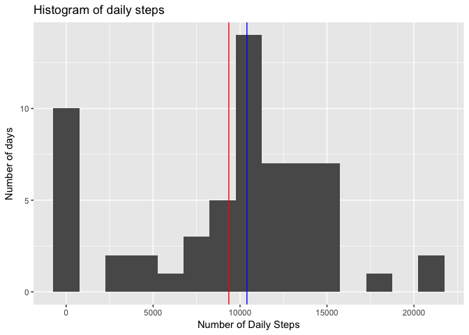
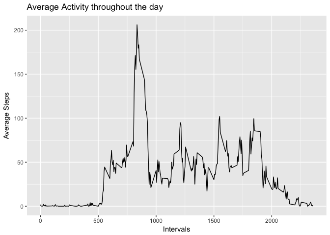
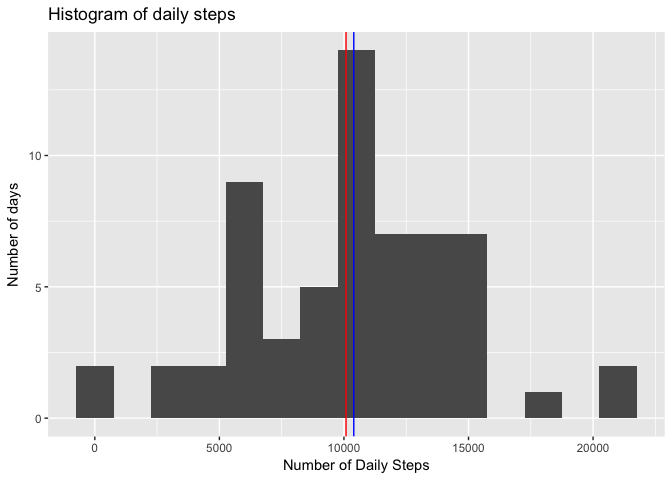
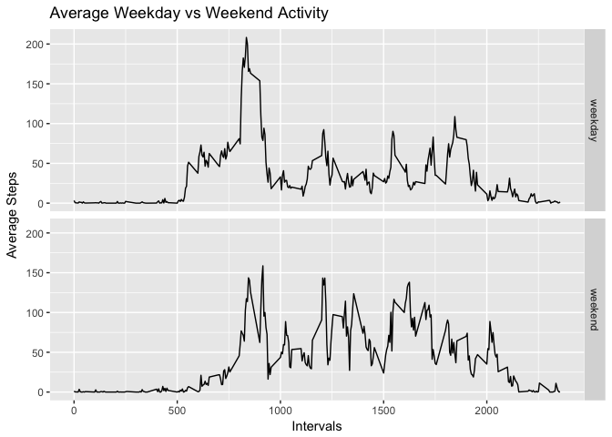

## Loading and preprocessing the data

We load the data and store it as a data frame names "activity".


```r
activity<-read.csv("activity.csv")
```

## What is mean total number of steps taken per day?

To look at the average number of steps per day, we first use the plyr package to sum the step data for each day. For now, we will remove the missing values so that they don't interfere with our analysis


```r
library(plyr)
daily<-ddply(activity,.(date),summarize,daily.steps=sum(steps,na.rm=TRUE))
```

Next, we use the ggplot package to plot a histogram of step total for each day for this two month span.


```r
library(ggplot2)
q<-ggplot(daily, (aes(daily.steps)))
q + geom_histogram(binwidth=1500) + 
    labs(title="Histogram of daily steps", y="Number of days", 
         x="Number of Daily Steps") + 
    geom_vline(xintercept=mean(daily$daily.steps), color="red") +
    geom_vline(xintercept=median(daily$daily.steps), color="blue")
```

<!-- -->

We have also included two vertical lines. The red line marks the mean daily step total and the blue line marks the median daily step total. We can verify these numbers with the summary command.


```r
print(summary(daily$daily.steps))
```

```
##    Min. 1st Qu.  Median    Mean 3rd Qu.    Max. 
##       0    6778   10395    9354   12811   21194
```

## What is the average daily activity pattern?

To look at the average daily activity pattern,we instead look at the average number of steps for each time interval over the two month span. Again,we use the plyr package to summarize the data and remove the missing values.


```r
avg_act<-ddply(activity,.(interval),summarize,avg.steps=mean(steps,na.rm=TRUE))
```

Next, we use ggplot2 package to plot the data as a line graph.


```r
q<-ggplot(avg_act,aes(interval,avg.steps)) 
q + geom_line() + labs(title="Average Activity throughout the day", 
                       x="Intervals", y="Average Steps") 
```

<!-- -->

From this plot, it looks like the average maximum activity level is sometime in the morning. Let's find the time interval.


```r
max_int<-avg_act$interval[which.max(avg_act$avg.steps)]
print(max_int)
```

```
## [1] 835
```

8:35 am. This user likes to work out in the morning, it seems.

## Imputing missing values

Next we will try to impute missing values instead of ignoring them. For this, we will use the impute package from bioconductor. Our impute method will use the 10 nearest days from the same time interval to estimate the missing value.


```r
library(impute)
activity2<-activity[with(activity,order(interval,date)),] #reorder by time interval
m<-as.matrix(activity2[,c(1,3)])
m.imputed<-impute.knn(m)$data
m.imputed<-as.data.frame(m.imputed)
activity2.imputed<-activity2
activity2.imputed$steps<-m.imputed$steps
```

Now we will follow the same steps as above to look at the average daily steps.


```r
daily.imputed<-ddply(activity2.imputed,.(date),summarize,daily.steps=sum(steps,na.rm=TRUE))
q<-ggplot(daily.imputed, (aes(daily.steps)))
q + geom_histogram(binwidth=1500) + 
    labs(title="Histogram of daily steps", y="Number of days", 
         x="Number of Daily Steps") + 
    geom_vline(xintercept=mean(daily.imputed$daily.steps), color="red") +
    geom_vline(xintercept=median(daily.imputed$daily.steps), color="blue")
```

<!-- -->

The median and mean have increased a bit. Let's look at the values.


```r
print(summary(daily.imputed$daily.steps))
```

```
##    Min. 1st Qu.  Median    Mean 3rd Qu.    Max. 
##      41    6778   10395   10085   12811   21194
```

## Are there differences in activity patterns between weekdays and weekends?

For this last section, we will create a new variable called "days" to distinguish weekdays from weekends. Let's see if average daily activity changes from weekdays to weekend.


```r
activity2.imputed$date<-as.Date(activity2.imputed$date)
day<-weekdays(activity2.imputed$date)
wke=c("Saturday","Sunday")
for (i in 1:length(day)){
    if (day[i] %in% wke) {day[i]="weekend"}
    else {day[i]="weekday"}
}
activity2.imputed$day<-factor(day, levels=c("weekday","weekend"))
```

Now that we have the new variable created, let's create a two-panel plot comparing the average daily activity pattern on weekdays with weekends.


```r
avg_act.imputed<-ddply(activity2.imputed,.(interval,day),summarize,
                       avg.steps=mean(steps))
q<-ggplot(avg_act.imputed,aes(interval,avg.steps)) 
q + geom_line() + labs(title="Average Weekday vs Weekend Activity", 
                       x="Intervals", y="Average Steps") +
    facet_grid(day~.)
```

<!-- -->

It does look like this user is less active on early weekend mornings, but has a higher sustained activity level thrugh the rest of the day.
